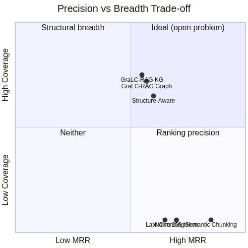
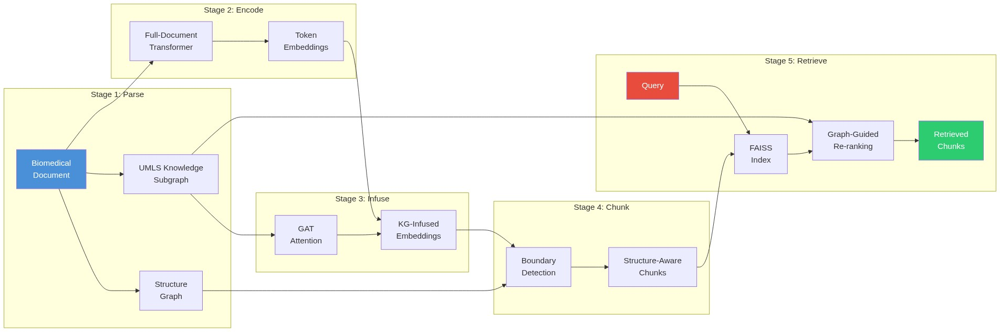
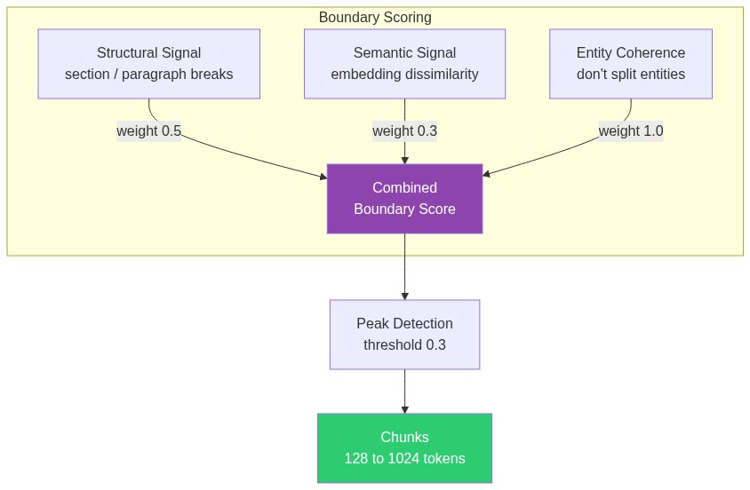
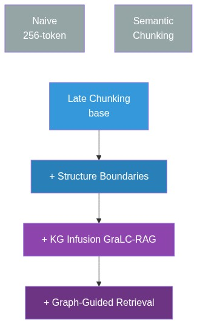

<div align="center">

# GraLC-RAG

**Graph-Aware Late Chunking for Retrieval-Augmented Generation in Biomedical Literature**

[](https://www.python.org/downloads/)
[](LICENSE)
[](https://pubmedqa.github.io/)
[](https://www.ncbi.nlm.nih.gov/pmc/tools/openftlist/)

*Standard retrieval metrics are structurally blind. We prove it.*

</div>

---

## The Problem

RAG systems for biomedical literature are evaluated with metrics like MRR that reward finding *one good chunk*. But scientific documents have structure: a method in Section 2 connects to results in Section 4. **MRR cannot see this.**

We built GraLC-RAG to investigate whether structure-aware retrieval helps, and discovered something more important: **content-similarity methods and structure-aware methods optimize for fundamentally different objectives**, and this divergence is invisible under standard evaluation.

## Key Results

> Evaluated on **2,359 IMRaD-filtered PubMed Central articles** with **2,033 cross-section questions**

| What we measured | Content-similarity (Semantic) | Structure-aware (GraLC-RAG) |
|:---|:---:|:---:|
| **MRR** (ranking accuracy) | **0.517** | 0.323 |
| **SecCov@20** (structural breadth) | 1.0 | **15.57** |
| **Section diversity** | 1 section | **15.6x more sections** |
| **Generation F1** | **0.403** | 0.394 (gap: 0.009) |

Neither class of methods dominates. They optimize for different things:

<div align="center">

</div>

## Architecture

GraLC-RAG unifies late chunking (context-rich, structure-blind) with GraphRAG (structure-rich, context-fragmented) in a five-stage pipeline:

<div align="center">

</div>

### Boundary Detection

Unlike flat chunking, GraLC-RAG uses three signals to find natural chunk boundaries:

<div align="center">

</div>

## Six Retrieval Strategies

<div align="center">

</div>

| # | Strategy | MRR Impact | SecCov@20 |
|:-:|:---------|:----------:|:---------:|
| 1 | Naive (256-token) | baseline | 1.0 |
| 2 | Semantic Chunking | **best MRR** | 1.0 |
| 3 | Late Chunking | -0.0019 | 1.0 |
| 4 | Structure-Aware | -0.0022 | 14.43 |
| 5 | GraLC-RAG (KG) | -0.0100 | **15.57** |
| 6 | GraLC-RAG (+Graph) | -0.0285 | **15.57** |

## Evaluation Metrics

We introduce two structural coverage metrics that expose what MRR misses:

| Metric | What it captures | Why it matters |
|:-------|:-----------------|:---------------|
| **MRR** | Where the best chunk ranks | Standard, but structurally blind |
| **Recall@k** | Whether the relevant chunk appears in top-k | Also structurally blind |
| **SecCov@k** | Distinct document sections in top-k | Measures retrieval breadth |
| **CS Recall** | Whether top-k spans multiple required sections | Measures cross-section reasoning |

## Installation

```bash
# Requires Python 3.11+
uv sync

# Or with pip
pip install -e .
```

## Quick Start

```bash
# Run the full pipeline
bash scripts/run_full_pipeline.sh
```

Or step by step:

```bash
# 1. Download PubMedQA + PMC full-text articles
python scripts/01_download_corpus.py

# 2. Index with all chunking strategies
python scripts/02_index_corpus.py

# 3. Evaluate retrieval (PubMedQA)
python scripts/03_evaluate_retrieval.py

# 4. Build full-text corpus (2,359 IMRaD articles)
python scripts/06_build_fulltext_corpus.py

# 5. Generate cross-section QA benchmark (2,033 questions)
python scripts/07_generate_crosssection_qa.py

# 6. Evaluate with structural coverage metrics
python scripts/08_evaluate_fulltext_retrieval.py

# 7. Generation quality (requires OPENAI_API_KEY)
python scripts/10_evaluate_fulltext_generation.py
```

## Configuration

Create a `.env` file:

```env
OPENAI_API_KEY=sk-...    # For generation experiments
NCBI_API_KEY=...         # Optional, increases PMC API rate limits
```

## Project Structure

```
src/gralc_rag/
├── benchmark/        # Cross-section QA benchmark construction
│   ├── template_qa.py    # 5 template types (Method→Result, Intro→Result, ...)
│   └── llm_qa.py         # LLM-based question generation
├── chunking/         # All chunking strategies
│   ├── naive.py          # Fixed-size (256 tokens, 32 overlap)
│   ├── semantic.py       # Embedding similarity boundaries
│   ├── late.py           # Full-document encoding → segment
│   └── structure_aware.py # Graph-informed boundaries
├── corpus/           # Data pipeline
│   ├── downloader.py     # PubMedQA + PMC Open Access
│   ├── parser.py         # JATS XML → structured documents
│   └── condition_builder.py  # Document-length gradient
├── evaluation/       # Metrics
│   ├── metrics.py        # MRR, Recall@k
│   ├── crosssection_metrics.py  # SecCov@k, CS Recall
│   └── statistical.py   # Significance testing
├── generation/       # Answer generation
│   └── openai_gen.py     # GPT-4o-mini evaluation
├── knowledge/        # UMLS integration
│   ├── entity_linker.py  # MeSH dictionary matching (41,774 terms)
│   ├── kg_infusion.py    # GAT-based token enrichment
│   └── umls_client.py    # UMLS API client
├── retrieval/        # Retrieval engines
│   ├── dense.py          # FAISS dense retrieval
│   ├── graph_guided.py   # KG proximity re-ranking
│   └── index.py          # Index management
└── config.py
```

## Citation

```bibtex
@article{mortezaagha2026gralcrag,
  title   = {Graph-Aware Late Chunking for Retrieval-Augmented
             Generation in Biomedical Literature},
  author  = {Mortezaagha, Pouria and Rahgozar, Arya},
  year    = {2026},
  note    = {Submitted to Scientific Reports}
}
```

## License

[MIT](LICENSE)
